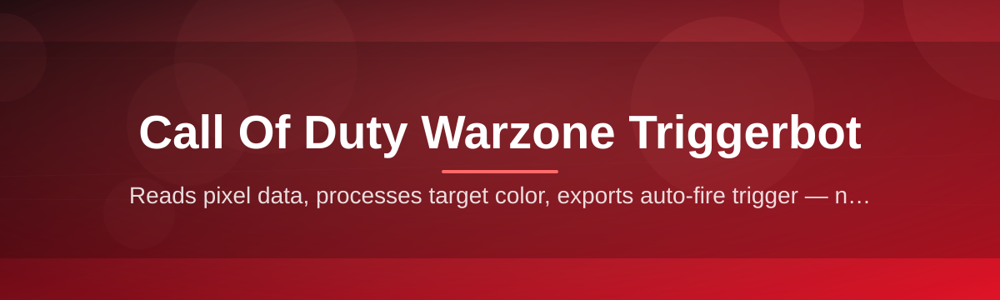

# warzone-trigger-assistant

Reads pixel data, processes target color, exports auto-fire trigger — no setup

  

## Overview

Reads pixel data, processes target color, exports auto-fire trigger — no setup

## License

[MIT License](LICENSE)
